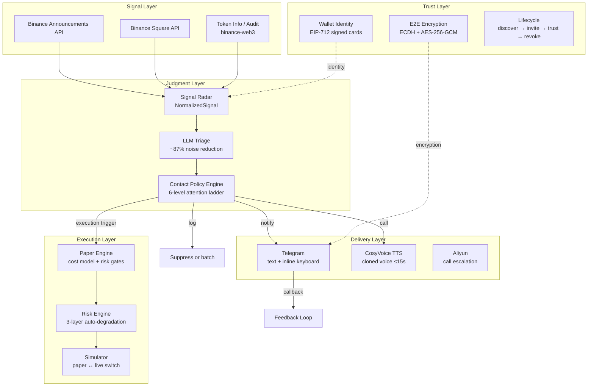

# Vigil Judge Guide

This guide is a one-page evaluator view of what Vigil is, what to inspect first, and one stable 5-minute verification path.

Companion docs:
- `docs/official-skills-manifest.json` (official skills coverage, stage, runtime, and output visibility)

## 0) Fast reading order

If you only open a few files, use this order:

1. `README.md` — top-level product loop and quick verification entry.
2. `docs/JUDGE_GUIDE.md` — this page.
3. `docs/JUDGE_ONE_PAGER.md` — expanded judge-facing context.
4. `docs/official-skills-manifest.json` — official skill coverage, stage, runtime, and output visibility.

## Term map

- **Living Assistant** = sensing + interruption judgment + briefing loop.
- **Signal Radar** = ecosystem signal ingestion layer.
- **Contact Policy** = policy engine that decides `log` / `notify` / `call`.
- **Voice Brief** = short user-facing voice summary.
- **Execution** = paper-first execution and risk-control loop.
- **Agent-Comm** = wallet-based trust and communication layer.

## 1) What this project is

Vigil is a BNB ecosystem assistant runtime that:

- senses ecosystem signals,
- judges whether a user should be interrupted,
- and routes outcomes through paper-first, explainable execution paths.

Deployment note: Vigil is built on the OpenClaw platform, leveraging platform capabilities for channel binding, session orchestration, delivery, and callback handling. For end users, the practical entrypoints are Telegram / voice / call rather than direct repo configuration.

## 2) What problem it solves

In practical operations, teams face three recurring issues:

1. too many raw signals and not enough prioritization,
2. weak safety boundaries between quick verification behavior and real execution,
3. poor evidence quality when explaining "why this action was taken."

Vigil addresses this with a single loop: `sense -> judge -> brief/act`, plus paper-first execution and replayable outputs.

## Technical Architecture



## 3) Three things to look at

1. **Judgment loop quality (Living Assistant)**
- Run `npm run demo:living-assistant`.
- Inspect fixture-driven scenarios in `fixtures/demo-scenarios/`.
- For API mode, inspect `/api/v1/living-assistant/demo/:scenarioName` and `/api/v1/living-assistant/evaluate`.

2. **Execution safety and evidence output**
- Start the API (`npm run dev`) and run `npm run discovery:smoke`.
- Review generated artifacts in `demo-output/discovery-smoke-*.json`.
- Check that the flow remains paper-safe by default unless explicitly switched.
- For approve routes, inspect `skillAttribution` (`requiredSkillsUsed`, `enrichmentSkillsUsed`, `distributionSkillsUsed`, `skillSources`) and compare with `docs/official-skills-manifest.json`.

3. **Trust and communication layer (Agent-Comm)**
- Review `scripts/agent-comm-demo.sh` and `docs/AGENT_COMM_EXPLAINED.md`.
- Look for wallet-based identity, signed contact cards, and encrypted message path.

## 4) 5-minute verification path

```bash
npm install
cp .env.example .env

# Terminal A
npm run dev

# Terminal B
npm run demo:living-assistant
```

Vigil 的核心设计围绕持续感知、策略驱动的中断判断、paper-first 执行和可回放的证据链。

`demo:living-assistant` 流程：

1. 运行 fixture-driven 本地场景验证，
2. 覆盖信号感知 → LLM 审核 → 注意力分级 → 简报生成完整链路，
3. 输出写入 `demo-output/`。

如需 API 模式验证，启动服务后运行 `npm run discovery:smoke`。

如遇 `401 unauthorized`，配置 API 密钥：

```bash
export API_SECRET="<your API_SECRET value>"
```

## 5) 验证路径与生产路径

**生产路径**（需要外部服务配置）：

- `npm run demo:living-assistant -- --live`（实时信号轮询），
- 执行后端集成（需要配置相关 credentials），
- 真实投递（`--send` / `--call` 需要有效的 Telegram / 阿里云凭证）。

**验证路径**（本地即可运行）：

- `npm run demo:living-assistant`（fixture-driven 本地场景），
- `/api/v1/living-assistant/demo/:scenarioName`（场景演示路由），
- `npm run discovery:smoke`（默认 paper 审批模式），
- `npm run demo:living-assistant -- --call --demo-delivery`（模拟电话投递）。

验证路径确保快速审阅的可信度，同时避免依赖不稳定的外部条件。
